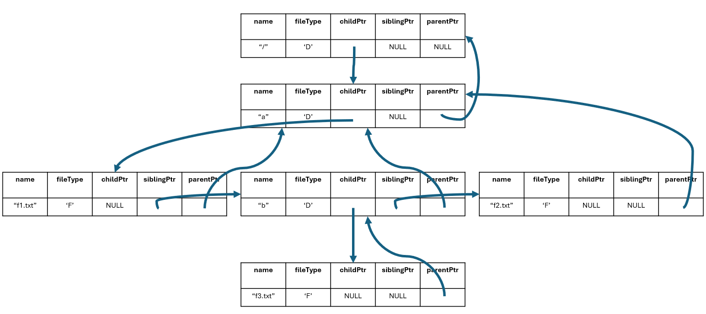

# Project 2 - File Tree Simulator

In this project, you will be simulating a Unix file system using a tree. This is based off of section 2.13 in the textbook. Feel free to read that section from the textbook for additional help and ideas.

## Problem Statement

We have seen a lot of useful commands so far, such as: **mkdir**, **rmdir**, **ls**, **pwd**, and **cd**. As we begin to study C, it turns out that there is an interesting application of a data structure called a _tree_ which allows us to simulate these commands in code. Though this project is only in C, it will be a good review for your Unix knowledge. For simplicity, we won't be implementing flags on commands.

A tree is a data structure which you'll see in *Data Structures & Algorithms*, *Discrete Math*, and again in *Algorithms*. For more on trees and dynamic structures, refer to the course textbook sections 2.10-2.13 (Wang, Systems Programming in Unix/Linux). In this project, you are given a starter code, which provides type definitions and helper functions to help you get started.

Your task on this project is to implement the **mkdir** command which will modify a tree that simulates a Linux file system tree, where nodes represent files or directories.

**Important Notes**: In order to implement the **mkdir** command correctly, you will have to implement the two functions in the source file: **mkdir_splitpath.c**. **main.c** and **types.h** files should not me modified. The implementations of the other commands, **rmdir**, **rm**, **ls**, **cd**, **pwd**, and **touch** are provided as compiled object code in **other_commands.o**. For these commands to work correctly, the function **splitPath** has to be correctly implemented by you. More details about the expected behavior of these functions are provided below.

## Solution executable

A complete solution executable, named **main**, is available and can be executed from the command line on isengard. This executable program has all the commands implemented.

When the program is executed you can type the following commands to interact with the simulated file system:

- cd: change directory, allows for the traversal between directories
- ls: list directory contents, displays files and directories within the current directory
- pwd: print working directory, shows the full path of the current directory
- rm: remove a file
- rmdir: remove an empty directory
- touch: create a file
- tree: displays the file system hierarchy with all the created directories and files
- menu: prints the list of available commands
- quit: quit the program

The program prompt is output to stderr. So, if you want to redirect input from a file and redirect the output to a file without the prompts appearing as part of the output, you can run it like below:

```
./main < test01.in 2>/dev/null > output.txt
```

## The Tree Structure

Each directory or file including the root directory is represented by a tree node whose type is defined as follows in _types.h_:

```
struct NODE {
    char name [64];
    char fileType;
    struct NODE* childPtr;
    struct NODE* siblingPtr;
    struct NODE* parentPtr;
};
```
The fileType field should be set to 'F' for regular files and to 'D' for directories. Each file and directory has a name, which is at most 63 characters long (note that we need the NULL char for the end). If the node represents a directory and it has files or other directories in it, the **childPtr** would point to the first file or directory created in it. The order of creation would dictate the order of the children. In order to traverse the children nodes, one needs to follow the sibling pointers, **siblingPtr**, starting with the first child's siblingPtr. Each file or directory also has a pointer to its unique parent. Note that only the root directory has its parentPts set to NULL (see the initialize() function in main.c).

If we run the simulator with the following commands:

```
mkdir a
cd a
touch f1.txt
mkdir b
touch f2.txt
cd b
touch f3.txt
tree
quit
```
we get the following output:

```
MKDIR SUCCESS: node a successfully created
MKDIR SUCCESS: node b successfully created
/
|
`---a
    |---f1.txt
    |---b
    |   |
    |   `---f3.txt
    |
    `---f2.txt
```

The nodes of the tree for this directory structure are shown below:



**Note:** **After the initialization of the tree, the only functions that create nodes in the tree structure are: mkdir() and touch(). The only functions that delete nodes from the tree structure are rm() and rmdir(). The functions tree(), splitPath(), and ls() just traverse the tree structure to acquire/print information.**

## Requirements for the splitPath() function

The function splitPath() with the following signature gets the complete path string to a file or directory as a relative or an absolute path:

```
struct NODE* splitPath(char* pathName, char* baseName, char* dirName)
```

The character array **pathName** is the path string which is the parameter to the commands, rm, rmdir, ls, cd, touch, mkdir. Note that when no parameter is specified, the path string is initialized to "/" by default. The goal of the splitPath function is to split the path string into two parts: **dirName** and **baseName**, which should character arrays setup by the caller function. The **dirName** is a sequence of directory names that show the path to the **baseName**, which is the name of the target file or directory. For example, for the path string "/a/b/c/f1.txt", "/a/b/c" should be copied over to the **dirName** and "f1.txt" should be copied over to the **baseName**. If the path string contains just the name of the file or directory (which means it refers to a file or directory in the current directory), then the **dirName** should just be an empty string, "", whereas **baseName** should be the same as the pathName (note that instead of direct pointer assignment, you should use string copying functions like strcpy or strncpy). In short, the **dirName** should be the first part of a **pathName** up to (and **excluding**) the last '/'. The rest of the string should be the **baseName**. Example edge cases: if the **pathName** is "/", **dirName** should be "/" and **baseName** should be "", if the **pathName** is "f1.txt", **dirName** should be "" and **baseName** should be "f1.txt"

In addition to setting the values for the **dirName** and **baseName** strings, the splitPath() function should return a pointer to the directory where the target file or directory resides. For example, if the **pathName** is "/a/b/c/f3.txt", splitPath() should return a pointer to the node structure that represents the directory "c". If the **pathName** is "/a/b/c", **dirName** should be set to "/a/b", **baseName** should be set to "c" and the function should return a pointer to the node structure that represents the directory "b".

splitPath() shoud print the following message in the standard output (note that the error messages are not to be output to the standard error), if it detects a non-existent directory on the path:

```
ERROR: directory <DIRECTORY> does not exist
```
The directory name that is printed in the error message must be the first non-existent directory when the path is traversed from the root directory.

**Hint:** Set the **baseName** and **dirName** first and traverse the **dirName** using the string tokenizer function `strtok`, splitting the **dirName** with the delimiter "/".

**Note:** **You can assume that no other path name other than "/" will end with the character "/". In other words, when referring to files and directories (other than the root dir), we will always end the path name with the name of the target directory or file. Also note that the directory aliases ".." and "." are not implemented as part of this project.**

## Requirements for the mkdir() function

The mkdir() function should make a call to the splitPath() function to get the target directory name as **baseName**. It should setup the strings to hold **baseName** and **dirName** before the call to the splitPath() function. Note that in implementing the mkdir() function you can ignore the **dirName** string as everything you need is in **baseName** and in the return value of the splitPath() function, which is the node structure representing the parent directory of the target directory to be created. You should allocate memory for a new tree node for the directory to be created. You should also check whether the target directory already exists in the current directory and print out an error message accordingly in the standard output (see the **Output Format** section below). If the user does not specify any input to the mkdir command, the pathName string will just be "/" and this should result in the error message "MKDIR ERROR: no path provided" in the standard output. If there is no error, the directory node should be created with its fields set correctly, e.g., fileType set to 'D', parentPtr set to the return value of splitPath() and childPtr and sblingPtr set to NULL, and the newly created node should be added as the sibling of the last file/directory created in that parent directory (if it is the first child, then the childPtr of the parent should be set). Upon successful completion, the message "MKDIR SUCCESS: node \<NODE\> successfully created" should be printed on standard output with \<NODE\> as the **pathName** input of the mkdir() function. 

## Input Format

Your program will take in input via stdin until the `quit` instruction is entered, in which case the program should end.

Your program will be tested with several inputs where each input is a sequence of commands separated by new lines.

## Output Format

Your **mkdir** implementation should print the following messages to stdout in the exact following format in each respective scenario:
```
MKDIR ERROR: directory <DIRECTORY> already exists
// or
MKDIR ERROR: no path provided
// or
MKDIR SUCCESS: node <NODE> successfully created
```

In addition, your **splitPath** implementation should print the following error message to the stdout in the exact following format when the path contains a reference to a non existing parent directory:
```
ERROR: directory <DIRECTORY> does not exist
```

## Sample Executions

### Sample Execution 1

Input
```
mkdir /a
mkdir /b
quit
```

Output
```
MKDIR SUCCESS: node /a created
MKDIR SUCCESS: node /b created
```

### Sample Execution 2

Input
```
mkdir /a/b
mkdir /a
mkdir /a/b
quit
```

Output
```
ERROR: directory a does not exist
MKDIR SUCCESS: node /a successfully created
MKDIR SUCCESS: node /a/b successfully created
```

### Sample Execution 3

Input
```
mkdir a/b
mkdir a
mkdir a/b
quit
```

Output
```
ERROR: directory a does not exist
MKDIR SUCCESS: node a successfully created
MKDIR SUCCESS: node a/b successfully created
```

### Sample Execution 4

Input
```
mkdir a
mkdir b
quit
```

Output
```
MKDIR SUCCESS: node a successfully created
MKDIR SUCCESS: node b successfully created
```

### Github Repo Setup and Gradescope Submission Instructions

Git command line tools is already installed on isengard. If you want to have git command line tools on your own Linux distribution, you can use the following command to install it:

```
sudo apt install git-all
```

The authentication uses SSH, so you need to first create your public keys using the **ssh-keygen** command, from the terminal prompt. You will also set a password during public key generation, so make sure you take a note of that password, as it will be required for connection to a github repo. **ssh-keygen** generates a couple of files. By default they are in the **.ssh** directory under your home directory. Use the following command to display the contents of your publich key:

```
cat ~/.ssh/id_rsa.pub
```

You are going to add the contents of this file to your Github profile as a new SSH key by going to https://github.com/settings/keys and then clicking on the New SSH Key link at the top-right of the page. Paste the contents of the id_rsa.pub file in the **Key** textbox and give it a name to this key to idenify the environment it was created in, e.g., isengard, my_macbook, etc.

The next step is to configure your git user settings from the terminal prompt from the same shell prompt where you did ssh-keygen. At the minimum you should configure your email and your name using the following commands (replace the email and name with your info):

```
git config --global user.email "tolgacan@mines.edu"
git config --global user.name "Tolga Can"
```

Create a private repository for this project under your own user name. For example, I created a private repo named **csci210_project2** and my github username is tolgacan. A private repo can be created from the GitHub web site by going to your repositories after clicking on your profile picture (e.g., https://github.com/tolgacan?tab=repositories) and clicking on the "New" button in the top right corner. After that, you can enter a command sequence similar to the one below to clone the starter repo and copy it to your private repo to work with. The **project2** repo under the organization **CSCI210Mines** is the public repository that contains the starter code.

```
git clone git@github.com:CSCI210Mines/project2.git
git remote remove origin
git remote add origin git@github.com:tolgacan/csci210_project2.git  # this is my private repo. replace it with your own private repo
git branch -M main
git push -u origin main
```

After these commands, you should have a copy of your starter code in your own repo and you can update the **mkdir_splitpath.c** with your solution code and execute the following git commands to push your updates to your own repo:

```
git add mkdir_splitpath.c
git commit -m "your commit message here"
git push -u origin main
```

You can also clone your repo and work on it and push the updates from different machines if you add the ssh public keys for these machines to your github profile.

**Submission on Gradescope:**

After you are logged in to your github account in a browser, if you follow the Gradescope assignment page for this project from Canvas and try to upload a submission, you will be able to select the Github submission options and select your private repository for this project to submit your solution on Gradescope.
